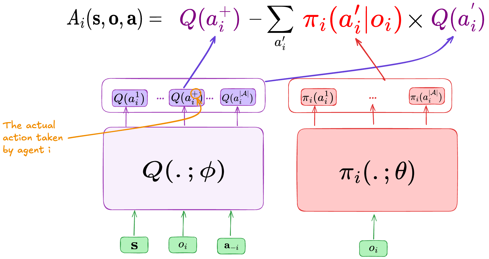

Counterfactual Multi-Agent
==========================

    - Paper link:  `COMA <https://arxiv.org/abs/1705.08926>`_ 

Quick facts:
    - COMA is an on-policy actor-critic algorithm. 
    - COMA uses a centralized critic with a decentralized actors.

Key ideas:

A straightforward adaptation of single actor-critic algorithms to multi-agent RL would be to have for each agent an actor :math:`\pi_i(a_i| o_i; \theta)` and a critic :math:`Q_i(o_i,a_i;\phi)` using the following losses:

.. math::

    \mathcal{L}^{actor}_i(\theta) = - A(o_i,a_i;\phi) log(\pi_i(a_i| o_i; \theta)) 

.. math::

    \mathcal{L}^{critic}_i(\phi) = (y - Q_i(o_i,a_i;\phi))^2

The two mean ideas of COMA is 

 1. To use only one centralized critic  :math:`Q(\mathbf{s}, \mathbf{o},\mathbf{a})`
 2. Replace the standard advantage :math:`A(o_i,a_i)` with an individual *counterfactual advantage* that compares the action-value of an agent' action :math:`a_i` to the expect action-value if the agent had selects other actions, while others' actions are fixed.

Concretely, we use the compute following advantage for each agent :math:`i \in \mathcal{I}` :

.. math::
        A_i(\mathbf{s}, \mathbf{o},\mathbf{a}) = Q(\mathbf{s}, \mathbf{o},\mathbf{a}) - \sum_{a'_i} \pi_i(a'_i|o_i) Q(\mathbf{s}, \mathbf{o},(\mathbf{a}_{-i},a'_i))

implementation-wise, the centralized Q-network takes as input :math:`\mathcal{s}`, the agent's observation :math:`o_i` and the other :math:`n-1` agents actions :math:`\mathbf{a}_{-i}` . The output the of network has the same size as the action-space, we output a value for each possible action :math:`a_i`. This architectures allows us to compute the counterfactual advantage easily.

Pseudocode
----------

Implementations
---------------

We implemented five variants of COMA:

- ``coma.py``: COMA with a single environment and MLP neural networks.
- ``coma_multienvs.py``: COMA with parallel environments and MLP neural networks.
- ``coma_lstm.py``: COMA with single environment and recurrent neural networks.
- ``coma_lstm_multienvs.py``: COMA with parallel environments and recurrent neural networks.
- ``coma_lbf.py``: COMA with a single environment and MLP neural networks with additional implementation tricks. This script was added to see if COMA can lean Level-Based Foraging environment. We add two things: (1) we use individual rewards and, (2) we correct TD target when the environment is truncated (i.e. time-out) rather than completed. 

Additional details:

- **Rollout buffer**:  we store episodes ``{"obs": [],"actions":[],"reward":[],"states":[],"done":[],"avail_actions":[]}``. Storing ``avail_actions`` is importing to compute the correct critic and actor losses
- **Parallel environment**: we run ``batch_size`` environments in parallel
- **Parallel environment with RNN networks**: When running multiple environments in parallel, some episodes may complete before others, therefor, we keep track of *alive anvironments* at each time step. This is especially important when using RNN policies as the size of the hidden state is fixed at the beginning  of the rollout  at ``(num_envs x num_agents, hidden_dim)`` , but we should only keep upadating ``(num_alive_envs x num_agents, hidden_dim)`` , when some episodes finish.
- **RNN training** : We use truncated backpropagation through time (TBPTT) to train the RNN network. You can set the length of the sequence using ``tbptt``. 
- **TD(λ) return**: we use the recursive formula from `Reconciling λ-Returns with Experience Replay (Equation 3) <https://arxiv.org/pdf/1810.09967>`_ . We start by :math:`R^{\lambda}_T = 0`

.. math::

   \begin{align}
   R^{\lambda}_t &= R^{(1)}_t + \gamma \lambda \Big[ R^{\lambda}_{t+1} - \max_{a' \in \mathcal{A}} Q(\hat{s}_{t+1}, a') \Big] \\
   &= r_t + \gamma  \Big[ \lambda R^{\lambda}_{t+1} + (1-\lambda) \max_{a' \in \mathcal{A}} Q(\hat{s}_{t+1}, a') \Big]
   \end{align}

- **Exploratioin**: We use the exploration strategy suggested in COMA paper.  :math:`ε` is linearly annealed across a number of training steps.

.. math::

    \pi(a_i) = (1 - \varepsilon) \, \text{softmax}(z_i) + \frac{\varepsilon}{|\mathcal{A}_i|}.

- **Individual rewards**: As COMA support individual rewards, we implement a COMA variants that support this configuration for LBF environments. You can allow individual rewards by setting ``reward_aggr=None`` for LBF environments. By default, LBF returns individual rewards

.. code-block:: python

    obs, reward, terminated, truncated, info = self.env.step(actions)
    ...
    if self.reward_aggr == "sum":
        reward = np.sum(reward)
    elif self.reward_aggr == "mean":
        reward = np.mean(reward)
    ## When reward_aggr == None, we keep it as a list of per-agent rewards.

Logging
-------

We record the following metrics:

- **rollout/ep_reward** : Mean episode reward during environment rollout.
- **rollout/ep_length** : Mean episode length during rollout.
- **rollout/epsilon** : Current exploration epsilon.
- **rollout/num_episodes** : Total number of completed episodes until the current step.
- **rollout/battle_won** (SMAClite only): Fraction of battle won by SMAC agents.
- **train/critic_loss** : The critic loss at the current optimization step.
- **train/actor_loss** : The actor loss at the current optimization step.
- **train/entropy** : The average entropy per-agent at the current optimization step
- **train/actor_gradients** : Magnitude of gradients of actor network.
- **train/critic_gradients** : Magnitude of gradients of critic network.
- **train/num_updates** : Total number of network updates until the current step.
- **eval/ep_reward** : Mean episode reward during evaluation.
- **eval/std_ep_reward** : Standard deviation of episode rewards during evaluation.
- **eval/ep_length** : Mean episode length during evaluation.
- **eval/battle_won** ( SMAClite only): Fraction of battles won during evaluation episodes.

Documentation
-------------

.. py:class:: cleanmarl.coma.Args(env_type="smaclite", env_name="3m", env_family="mpe", agent_ids=True, batch_size=3, actor_hidden_dim=32, actor_num_layers=1, critic_hidden_dim=128, critic_num_layers=1, optimizer="Adam", learning_rate_actor=0.0005, learning_rate_critic=0.0005, total_timesteps=1000000, gamma=0.99, td_lambda=0.8, normalize_reward=False, normalize_advantage=True, normalize_return=False, target_network_update_freq=1, polyak=0.005, entropy_coef=0.001, use_tdlamda=True, nsteps=1, start_e=0.5, end_e=0.002, exploration_fraction=750, clip_gradients=-1, log_every=10, eval_steps=50, num_eval_ep=5, use_wnb=False, wnb_project="", wnb_entity="", device="cpu", seed=1)

    :param env_type: Type of the environment: ``smaclite``, ``pz`` for PettingZoo, ``lbf`` for Level-based Foraging.
    :type env_type: str

    :param env_name: Name of the environment (``3m``, ``simple_spread_v3``, ``Foraging-2s-10x10-4p-2f-v3`` ...).
    :type env_name: str

    :param env_family: Env family when using a PettingZoo environment (``sisl``, ``mpe`` ...).
    :type env_family: str

    :param agent_ids: Include agent IDs (one-hot vector) in observations.
    :type agent_ids: bool

    :param batch_size: Number of episodes to collect in each rollout.
    :type batch_size: int

    :param actor_hidden_dim: Hidden dimension of the actor network.
    :type actor_hidden_dim: int

    :param actor_num_layers: Number of hidden layers of the actor network.
    :type actor_num_layers: int

    :param critic_hidden_dim: Hidden dimension of the critic network.
    :type critic_hidden_dim: int

    :param critic_num_layers: Number of hidden layers of the critic network.
    :type critic_num_layers: int

    :param optimizer: The optimizer.
    :type optimizer: str

    :param learning_rate_actor: Learning rate for the actor.
    :type learning_rate_actor: float

    :param learning_rate_critic: Learning rate for the critic.
    :type learning_rate_critic: float

    :param total_timesteps: Total steps in the environment during training.
    :type total_timesteps: int

    :param gamma: Discount factor.
    :type gamma: float

    :param use_tdlamda: Whether to use TD(λ) as a target for the critic. If False, n-step returns (``n=nsteps``) are used instead.
    :type use_tdlamda: bool

    :param td_lambda: TD(λ) discount factor.
    :type td_lambda: float

    :param nsteps: Number of steps when using n-step returns as a target for the critic.
    :type nsteps: int

    :param normalize_reward: Normalize the rewards if True.
    :type normalize_reward: bool

    :param normalize_advantage: Normalize the advantage if True.
    :type normalize_advantage: bool

    :param normalize_return: Normalize the returns if True.
    :type normalize_return: bool

    :param target_network_update_freq: Update the target network each ``target_network_update_freq`` training step.
    :type target_network_update_freq: int

    :param polyak: Polyak coefficient when using polyak averaging for target network update.
    :type polyak: float

    :param entropy_coef: Entropy coefficient used to encourage exploration.
    :type entropy_coef: float

    :param start_e: The starting value of epsilon. See *Architecture & Training* in COMA’s paper (Sec. 5).
    :type start_e: float

    :param end_e: The end value of epsilon. See *Architecture & Training* in COMA’s paper (Sec. 5).
    :type end_e: float

    :param exploration_fraction: Number of training steps required to linearly decay epsilon from ``start_e`` to ``end_e``.
    :type exploration_fraction: int

    :param clip_gradients: ``0<`` for no gradient clipping and ``0>`` if clipping gradients at ``clip_gradients``.
    :type clip_gradients: float

    :param log_every: Log rollout stats every ``log_every`` episode.
    :type log_every: int

    :param eval_steps: Evaluate the policy every ``eval_steps`` training steps.
    :type eval_steps: int

    :param num_eval_ep: Number of evaluation episodes.
    :type num_eval_ep: int

    :param use_wnb: Logging to Weights & Biases if True.
    :type use_wnb: bool

    :param wnb_project: Weights & Biases project name.
    :type wnb_project: str

    :param wnb_entity: Weights & Biases entity name.
    :type wnb_entity: str

    :param device: Device (``cpu``, ``gpu``, ``mps``). *We only support CPU training for now.*
    :type device: str

    :param seed: Random seed.
    :type seed: int

.. py:class:: cleanmarl.coma_multienvs.Args(env_type="smaclite", env_name="3m", env_family="mpe", agent_ids=True, batch_size=3, actor_hidden_dim=32, actor_num_layers=1, critic_hidden_dim=128, critic_num_layers=1, optimizer="Adam", learning_rate_actor=0.0005, learning_rate_critic=0.0005, total_timesteps=1000000, gamma=0.99, td_lambda=0.8, normalize_reward=False, normalize_advantage=True, normalize_return=False, target_network_update_freq=1, polyak=0.005, entropy_coef=0.001, use_tdlamda=True, nsteps=1, start_e=0.5, end_e=0.002, exploration_fraction=750, clip_gradients=-1, log_every=10, eval_steps=10, num_eval_ep=10, use_wnb=False, wnb_project="", wnb_entity="", device="cpu", seed=1)

.. py:class:: cleanmarl.coma_lstm.Args(env_type="smaclite", env_name="3m", env_family="mpe", agent_ids=True, batch_size=5, actor_hidden_dim=32, actor_num_layers=1, critic_hidden_dim=128, critic_num_layers=1, optimizer="Adam", learning_rate_actor=0.0005, learning_rate_critic=0.0005, total_timesteps=1000000, gamma=0.99, td_lambda=0.8, normalize_reward=False, normalize_advantage=True, normalize_return=False, target_network_update_freq=1, polyak=0.005, eval_steps=10, use_tdlamda=True, nsteps=1, start_e=0.5, end_e=0.002, exploration_fraction=750, clip_gradients=-1, tbptt=10, log_every=10, num_eval_ep=10, entropy_coef=0.001, use_wnb=False, wnb_project="", wnb_entity="", device="cpu", seed=1)

    :param tbptt: Chunk size for Truncated Backpropagation Through Time (TBPTT).
    :type tbptt: int

.. py:class:: cleanmarl.coma_lstm_multienvs.Args(env_type="smaclite", env_name="3m", env_family="mpe", agent_ids=True, batch_size=3, actor_hidden_dim=32, actor_num_layers=1, critic_hidden_dim=128, critic_num_layers=1, optimizer="Adam", learning_rate_actor=0.0005, learning_rate_critic=0.0005, total_timesteps=1000000, gamma=0.99, td_lambda=0.8, normalize_reward=False, normalize_advantage=True, normalize_return=False, target_network_update_freq=1, polyak=0.005, entropy_coef=0.001, use_tdlamda=True, nsteps=1, start_e=0.5, end_e=0.002, exploration_fraction=750, clip_gradients=-1, tbptt=10, log_every=10, eval_steps=50, num_eval_ep=10, use_wnb=False, wnb_project="", wnb_entity="", device="cpu", seed=1)

    :param tbptt: Chunk size for Truncated Backpropagation Through Time (TBPTT).
    :type tbptt: int