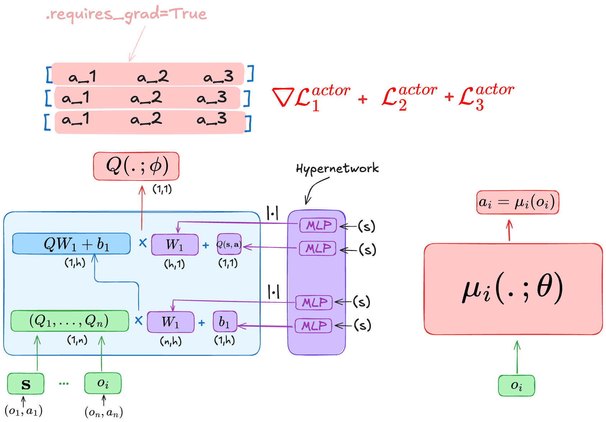

Factored Multi-Agent Centralised Policy Gradients
=================================================

    - Paper link:  `MADDPG <https://arxiv.org/abs/2003.06709>`_ 

Quick facts:
    - FACMAC is an off-policy actor-critic algorithm.
    - FACMAC uses a centralized critic with decentralized actors.

FACMAC is similar to both QMIX and MADDPG. Similar to QMIX as it uses the same approach to train a centralized critic network. We use individual critics that are mixed with weights generated using a hypernetwork. 

.. math::
    Q^{\text{tot}}(\mathbf{s}, \mathbf{o},\mathbf{a};\phi,\psi) = g(\mathbf{s}, Q_1(o_1, a_1;\phi), \dots,Q_n(o_n, a_n;\phi); \psi)

FACMAC is similar to MADDPG as it's also an actor critic algorithm and uses a determinisitic policy,however, they are different in how they update the policy network. While in MADDPG, the actor loss of agent :math:`i` samples the other agents actions from the replay buffer as explained in  :doc:`MADDPG <maddpg>`, in FACMAC, we sampled them from the current policies instead: 

.. math::

   \nabla_{\theta} \mu_i(o_i) \, \nabla_{a_i} Q(s, a_1 =\mu_1(o_1), \dots,a_i =\mu_i(o_i), \dots , \dots,a_n =\mu_n(o_n),) 

Pseudocode
----------

