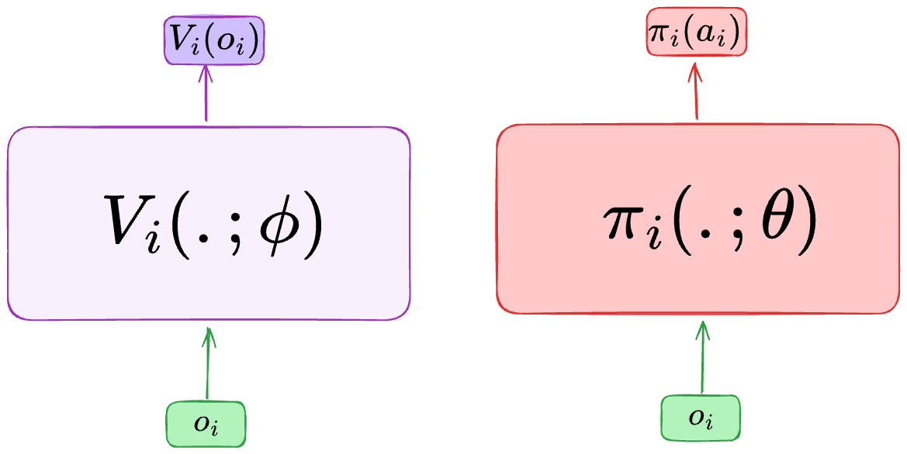

Independent Proximal Policy Optimization
========================================

    - Paper link:  `IPPO <https://arxiv.org/abs/2011.09533>`_ 

Quick facts:
    - IPPO is each agent implementing PPO using its local observations and actions. 

Independent PPO is a straightforward extension of PPO into multi-agent RL. In IPPO, the actors and critics conditions on local observations :math:`o_i` and the agents share the weights. 

For each agent :math:`i`  we use the following loss for the actors: 

.. math::

   L_i(\theta) = 
     \min\!\left(
       \frac{\pi(a_i^t \mid o_i^t;\theta)}{\pi(a_i^t \mid o_i^t;\theta_{\text{old}})}\, A_i^t,\;
       \operatorname{clip}\!\left(\frac{\pi(a_i^t \mid o_i^t;\theta)}{\pi(a_i^t \mid o_i^t;\theta_{\text{old}})},\,1-\varepsilon,\,1+\varepsilon\right) A_i^t
     \right)
   
with :math:`A_i^t` estimated using GAE method with :math:`V_i(;\phi)`

And for the critics, we use:

.. math::

    y_i - V_i(o_i;\phi)

where :math:`y_i` can be any TD target.

Pseudocode
----------

Implementations
---------------

We implemented four variants of IPPO:

- ``ippo.py``: IPPO with a single environment and MLP neural networks.
- ``ippo_multienvs.py``: IPPO with parallel environments and MLP neural networks.
- ``ippo_lstm.py``: IPPO with single environment and recurrent neural networks.
- ``ippo_lstm_multienvs.py``: IPPO with parallel environments and recurrent neural networks.

Additional details:

- **Rollout buffer**:  we store episodes ``{"obs": [],"actions":[],"reward":[],"states":[],"done":[],"avail_actions":[]}``. Storing ``avail_actions`` is importing to compute the correct critic and actor losses.
- **Parallel environment**: we run ``batch_size`` environments in parallel
- **Parallel environment with RNN networks**: When running multiple environments in parallel, some episodes may complete before others, therefor, we keep track of *alive anvironments* at each time step. This is especially important when using RNN policies as the size of the hidden state is fixed at the beginning  of the rollout  at ``(num_envs x num_agents, hidden_dim)`` , but we should only keep upadating ``(num_alive_envs x num_agents, hidden_dim)`` , when some episodes finish.

- **TD(λ) return**: we use the recursive formula from `Reconciling λ-Returns with Experience Replay (Equation 3) <https://arxiv.org/pdf/1810.09967>`_ . We start by :math:`R^{\lambda}_T = 0`

.. math::

   \begin{align}
   R^{\lambda}_t &= R^{(1)}_t + \gamma \lambda \Big[ R^{\lambda}_{t+1} - \max_{a' \in \mathcal{A}} Q(\hat{s}_{t+1}, a') \Big] \\
   &= r_t + \gamma  \Big[ \lambda R^{\lambda}_{t+1} + (1-\lambda) \max_{a' \in \mathcal{A}} Q(\hat{s}_{t+1}, a') \Big]
   \end{align}

- **Advantages**: We don't directly compute the advantages using GAE estimates, we instead use the TD(λ) return by exploiting the following formula that can be found in  `page 47 in David Silver's lecture n 4 <https://davidstarsilver.wordpress.com/wp-content/uploads/2025/04/lecture-4-model-free-prediction-.pdf>`_ 

.. math::

  A(s_t,a_t) = R^{\lambda}_t -V(s_t)

- **RNN training** : We use truncated backpropagation through time (TBPTT) to train the RNN network. You can set the length of the sequence using ``tbptt``. 

Logging
-------

We record the following metrics:

- **rollout/ep_reward** : Mean episode reward during environment rollout.
- **rollout/ep_length** : Mean episode length during rollout.
- **rollout/num_episodes** : Total number of completed episodes until the current step.
- **rollout/battle_won** (SMAClite only): Fraction of battle won by SMAC agents.
- **train/critic_loss** : The critic loss at the current optimization step.
- **train/actor_loss** : The actor loss at the current optimization step.
- **train/entropy** : The average entropy per-agent at the current optimization step.
- **train/kl_divergence** : The average kl-divergence per-agent at the current optimization step.
- **train/clipped_ratios** : The ratio of clipped policies at the current optimization step.
- **train/actor_gradients** : Magnitude of gradients of actor network.
- **train/critic_gradients** : Magnitude of gradients of critic network.
- **train/num_updates** : Total number of network updates until the current step.
- **eval/ep_reward** : Mean episode reward during evaluation.
- **eval/std_ep_reward** : Standard deviation of episode rewards during evaluation.
- **eval/ep_length** : Mean episode length during evaluation.
- **eval/battle_won** ( SMAClite only): Fraction of battles won during evaluation episodes.

Documentation
-------------

.. py:class:: cleanmarl.ippo.Args(env_type="smaclite", env_name="3m", env_family="mpe", agent_ids=True, batch_size=3, actor_hidden_dim=32, actor_num_layers=1, critic_hidden_dim=32, critic_num_layers=1, optimizer="Adam", learning_rate_actor=0.0008, learning_rate_critic=0.0008, total_timesteps=1000000, gamma=0.99, td_lambda=0.95, normalize_reward=False, normalize_advantage=False, normalize_return=False, ppo_clip=0.2, entropy_coef=0.001, epochs=3, clip_gradients=-1, log_every=10, eval_steps=50, num_eval_ep=10, use_wnb=False, wnb_project="", wnb_entity="", device="cpu", seed=1)

    :param env_type: Type of the environment: ``smaclite``, ``pz`` for PettingZoo, ``lbf`` for Level-based Foraging.
    :type env_type: str

    :param env_name: Name of the environment (``3m``, ``simple_spread_v3`` ``Foraging-2s-10x10-4p-2f-v3`` ...)
    :type env_name: str

    :param env_family: Env family when using a PettingZoo environment (``sisl``, ``mpe`` ...)
    :type env_family: str

    :param agent_ids: Include agent IDs (one-hot vector) in observations
    :type agent_ids: bool

    :param batch_size: Number of episodes to collect in each rollout
    :type batch_size: int

    :param actor_hidden_dim: Hidden dimension of actor network
    :type actor_hidden_dim: int

    :param actor_num_layers: Number of hidden layers of actor network
    :type actor_num_layers: int

    :param critic_hidden_dim: Hidden dimension of critic network
    :type critic_hidden_dim: int

    :param critic_num_layers: Number of hidden layers of critic network
    :type critic_num_layers: int

    :param optimizer: The optimizer
    :type optimizer: str

    :param learning_rate_actor: Learning rate for the actor
    :type learning_rate_actor: float

    :param learning_rate_critic: Learning rate for the critic
    :type learning_rate_critic: float

    :param total_timesteps: Total steps in the environment during training
    :type total_timesteps: int

    :param gamma: Discount factor
    :type gamma: float

    :param td_lambda: TD(λ) discount factor
    :type td_lambda: float

    :param normalize_reward: Normalize the rewards if True
    :type normalize_reward: bool

    :param normalize_advantage: Normalize the advantage if True
    :type normalize_advantage: bool

    :param normalize_return: Normalize the returns if True
    :type normalize_return: bool

    :param ppo_clip: PPO clipping factor
    :type ppo_clip: float

    :param entropy_coef: Entropy coefficient
    :type entropy_coef: float

    :param epochs: Number of training epochs
    :type epochs: int

    :param clip_gradients: 0 < for no clipping and 0 > if clipping at clip_gradients
    :type clip_gradients: float

    :param log_every: Log rollout statistics every ``log_every`` episode
    :type log_every: int

    :param eval_steps: Evaluate the policy each ``eval_steps`` training steps
    :type eval_steps: int

    :param num_eval_ep: Number of evaluation episodes
    :type num_eval_ep: int

    :param use_wnb: Logging to Weights & Biases if True
    :type use_wnb: bool

    :param wnb_project: Weights & Biases project name
    :type wnb_project: str

    :param wnb_entity: Weights & Biases entity name
    :type wnb_entity: str

    :param device: Device (cpu, gpu, mps)
    :type device: str

    :param seed: Random seed
    :type seed: int
  

.. py:class:: cleanmarl.ippo_multienvs.Args(env_type="smaclite", env_name="3m", env_family="mpe", agent_ids=True, batch_size=3, actor_hidden_dim=32, actor_num_layers=1, critic_hidden_dim=32, critic_num_layers=1, optimizer="Adam", learning_rate_actor=0.0008, learning_rate_critic=0.0008, total_timesteps=1000000, gamma=0.99, td_lambda=0.95, normalize_reward=False, normalize_advantage=False, normalize_return=False, ppo_clip=0.2, entropy_coef=0.001, epochs=3, clip_gradients=-1, log_every=10, eval_steps=50, num_eval_ep=10, use_wnb=False, wnb_project="", wnb_entity="", device="cpu", seed=1)

.. py:class:: cleanmarl.ippo_lstm.Args(env_type="smaclite", env_name="3m", env_family="mpe", agent_ids=True, batch_size=3, actor_hidden_dim=32, actor_num_layers=1, critic_hidden_dim=32, critic_num_layers=1, optimizer="Adam", learning_rate_actor=0.0008, learning_rate_critic=0.0008, total_timesteps=1000000, gamma=0.99, td_lambda=0.95, normalize_reward=False, normalize_advantage=False, normalize_return=False, log_every=10, ppo_clip=0.2, entropy_coef=0.001, epochs=3, clip_gradients=-1, tbptt=5, eval_steps=50, num_eval_ep=10, use_wnb=False, wnb_project="", wnb_entity="", device="cpu", seed=1)

  :param tbptt: Chunk size for Truncated Backpropagation Through Time (TBPTT).
  :type tbptt: int

.. py:class:: cleanmarl.ippo_lstm_multienvs.Args(env_type="smaclite", env_name="3m", env_family="mpe", agent_ids=True, batch_size=3, actor_hidden_dim=32, actor_num_layers=1, critic_hidden_dim=32, critic_num_layers=1, optimizer="AdamW", learning_rate_actor=0.0008, learning_rate_critic=0.0008, total_timesteps=1000000, gamma=0.99, td_lambda=0.95, normalize_reward=False, normalize_advantage=False, normalize_return=False, log_every=10, ppo_clip=0.2, entropy_coef=0.001, epochs=3, clip_gradients=-1, tbptt=5, eval_steps=50, num_eval_ep=10, use_wnb=False, wnb_project="", wnb_entity="", device="cpu", seed=1)

