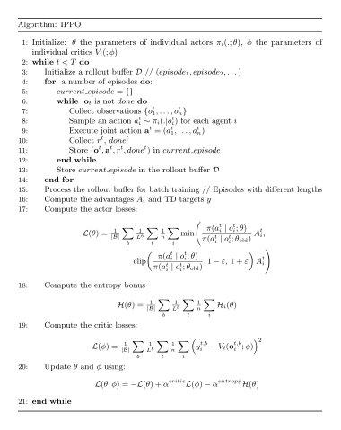

Independent Proximal Policy Optimization
========================================

    - Paper link:  `IPPO <https://arxiv.org/abs/2011.09533>`_ 

Quick facts:
    - IPPO is each agent implementing PPO using its local observations and actions. 

Independent PPO is a straightforward extension of PPO into multi-agent RL. In IPPO, the actors and critics conditions on local observations :math:`o_i` and the agents share the weights. 

For each agent :math:`i`  we use the following loss for the actors: 

.. math::

   L_i(\theta) = 
     \min\!\left(
       \frac{\pi(a_i^t \mid o_i^t;\theta)}{\pi(a_i^t \mid o_i^t;\theta_{\text{old}})}\, A_i^t,\;
       \operatorname{clip}\!\left(\frac{\pi(a_i^t \mid o_i^t;\theta)}{\pi(a_i^t \mid o_i^t;\theta_{\text{old}})},\,1-\varepsilon,\,1+\varepsilon\right) A_i^t
     \right)
   
with :math:`A_i^t` estimated using GAE method with :math:`V_i(;\phi)`

And for the critics, we use:

.. math::

    y_i - V_i(o_i;\phi)

where :math:`y_i` can be any TD target.

Pseudocode
----------
