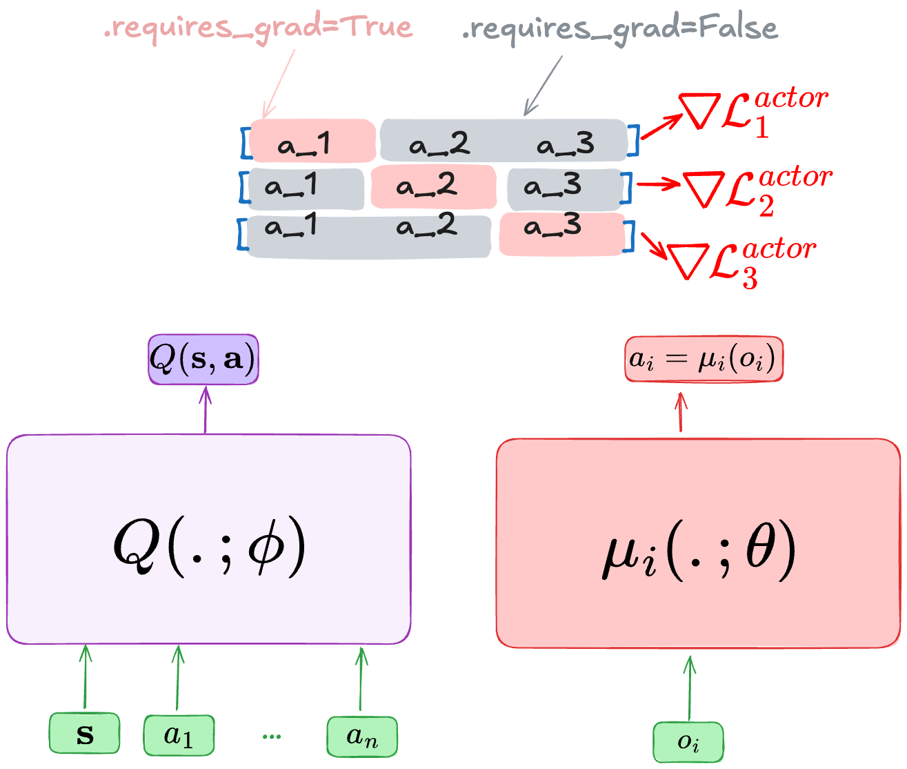

Multi-Agent Deep Deterministic Policy Gradient
==============================================

    - Paper link:  `MADDPG <https://arxiv.org/abs/1706.02275>`_ 

Quick facts:
    - MADDPG is an off-policy actor-critic algorithm.
    - MADDPG uses a centralized critic with decentralized actors.
    - MADDPG support continuous and discrete actions. 
    - MADDPG support individual rewards, thus can be used for cooperative, competitive, and mixed. 

MADDPG is an extension of DDPG to multi-agent settings with the difference that we use a centralized ciritc. The critic network takes as input the state information and the agents actions :math:`Q(\mathbf{s},\mathbf{a};\phi)` and outputs a single value. When having individual rewards, we can use separate centralized critics :math:`Q_i(\mathbf{s},\mathbf{a};\phi_i)`. We also have deterministic individual policies :math:`\mu(o_i;\theta)`. For discrete actions, we use Gumbel-Softmax estimation to compute the gradients with respect to the actions. 

MADDPG is an off-policy algorithm, so we store transitions when interacting with the environment and sample batches when training the actor and critic. In the following, the superscript :math:`b` on top of a variable means that the value is sampled from the replay buffer.  
To train the critic we use the following loss:

.. math::
    r + \gamma Q(\mathbf{s'^b},\mu(o'^b_1;\theta^-), \dots , \mu(o'^b_n;\theta^-); \phi^-) - Q(\mathbf{s}^b,a^b_1, \dots , a^b_n; \phi)

To better understand how to update the actor of agent :math:`i` , it's better if we pay close attention to the used gradient:

.. math::

   \nabla_{\theta} \mu_i(o_i) \, \nabla_{a_i} Q(s, a^b_1, \dots,a_i =\mu_i(o_i), \dots , a^b_n) 

When computing the gradients of agent :math:`i`, all the actions are those from the replay buffer, except the :math:`i-th` actions.

Pseudocode
----------

