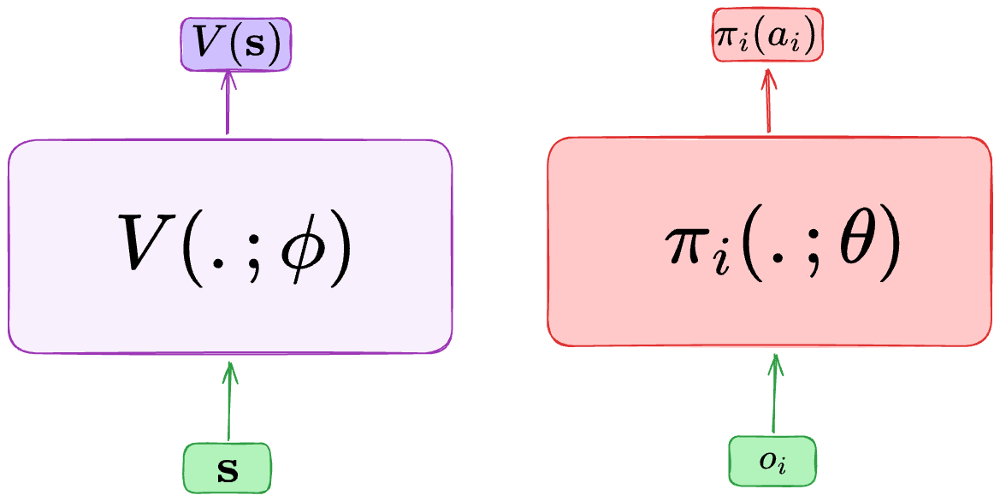

Multi-Agent Proximal Policy Optimization
========================================

    - Paper link:  `IPPO <https://arxiv.org/abs/2103.01955>`_ 

Quick facts:
    - MAPPO trains a centralized critic and decentralized actors.

Ihe unique difference between MAPPO and IPPO is that MAPPO uses a centralizes critic :math:`V(s;\phi)`, instead of a decentralized critic :math:`V_i(o_i;\phi)`

Pseudocode
----------

