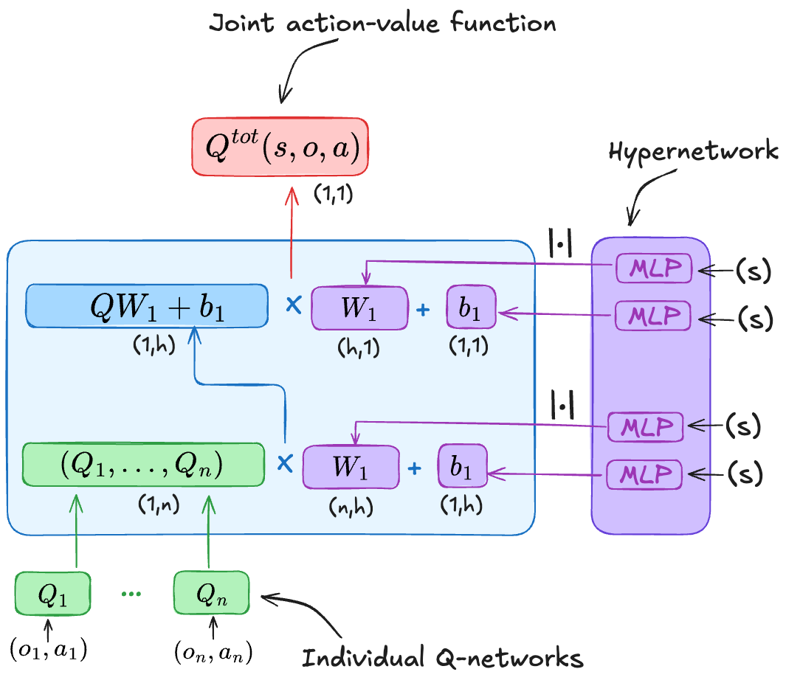
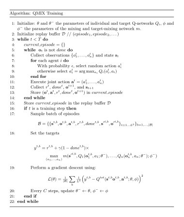

Monotonic Value Function Factorization
======================================

    - Paper link:  `QMIX <https://arxiv.org/abs/1803.11485>`_ 

Quick facts:
    - QMIX is an off-policy and value-based algorithm.
    - QMIX works only for discrete actions.

VDN enable us to have decentralized policies from a centralized action-value function. However, it has two key limitations that QMIX will solve: (1) The additive assumption to too restrictive. VDN limits the representation of central action-value functions we can learn, it uses a simple sum, instead of a more complex and probably a more capable representation (2) VDN networks cannot expoloit any extra information from the state when available. 

The main idea of both VDN and QMIX, is how to extract decentralized policies from a centralized network. While VDN only support linear decomposition, QMIX support complex and non-linear decompositions. 

The main idea of QMIX is that it is enough to ensure a consistency property in order to extract dencentralized policies from a centralized one. This consistency is the following: the global argmax performed on :math:`Q^{tot}` is the same as a set of individual argmax operations performed on each individual :math:`Q_i`: 

.. math::
   :nowrap:
   :label: eq-loss

   \begin{equation}
   \arg\max_{a} Q^{\text{tot}}(\mathbf{s}, \mathbf{o},\mathbf{a})
   =
   \begin{pmatrix}
   \arg\max_{u_1} Q_1(o_1, a_1) \\
   \vdots \\
   \arg\max_{u_n} Q_n(o_n, a_n)
   \end{pmatrix}
   \end{equation}

Our goal is to find a mixing function :math:`g` that satisfies :eq:`eq-loss` such that:

.. math::
    Q^{\text{tot}}(\mathbf{s}, \mathbf{o},\mathbf{a}) = g(\mathbf{s}, Q_1(o_1, a_1;\theta), \dots,Q_n(o_n, a_n;\theta); \phi)

It's worth noticing that VDN already satisfy this property. 

A sufficiant but not necessary condition to find a function :math:`g` is to enforce a monotonicity constraint between :math:`Q^{tot}` and :math:`Q_i`: 

.. math::

   \frac{\partial Q^{\text{tot}}}{\partial Q_i} \ge 0, \quad \forall i \in \mathcal{I}

In general, for a neural network :math:`g(. ; \phi)` to be monotonic with respect to its inputs, its weights must be posotove. We use this property to find a mixing function.
To achieve all of this, we use three neural networks:

    - Individual action value networks: :math:`Q_i(o_i,a_i)`
    - A hypernetwork that takes as input the state :math:`s` and generate a set of positive weights :math:`\phi`. Those weights are the parameters of the mixing network.
    - A mixing network whose parameters are generated by the hypernetwork, takes as input the individual Q-functions and outputs a centralized value function. 

Finally, to train these networks, we use the following loss: 

.. math::

    r + \gamma (1- done) \max_{\mathbf{a'}} Q^{tot}(\mathbf{s'},\mathbf{o'},\mathbf{a'}; \theta^-, \phi^-) - Q^{tot}(\mathbf{s},\mathbf{o},\mathbf{a}; \theta, \phi)

Pseudocode
----------

