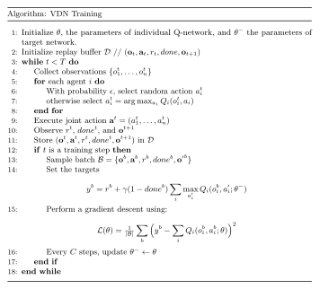

Value-Decomposition Networks For Cooperative Multi-Agent Learning
=================================================================

    - Paper link:  `VDN <https://arxiv.org/abs/1706.05296>`_ 

Quick facts:
    - VDN is an off-policy and value-based algorithm.
    - VDN works only for discrete actions.
    - Needs a common reward.
    - Additive factorization.

Key ideas:
    - VDN learns centralized action-value function :math:`Q^{tot}` decomposed into the same of individual :math:`Q_i` networks

    .. math::

        Q(\mathbf{o}, \mathbf{a}) = \sum_{i \in I} Q_i(o_i, a_i).

    - This factorization allows us to have decentralized policies.

    - :math:`Q_i` networks are refereed to as *utility networks* instead of action-value function, as they don't satisfy the Bellman equation. Instead,  :math:`Q^{tot}` is a true action-value function.

VDN is based on Q-learning and works with settings with common reward :math:`r`. Let's forget about the VDN for now and focus on how Q-learning can solve the cooperative MARL problem. There are two approaches we can use, each with its pros and cons.

The first approach is to use a single-agent RL algorithm. This consists of considering that there is **one central agent** who receives the joint observation :math:`\mathbf{o}_t` and its action is the joint action :math:`\mathbf{a}_t`. Then our goal is to estimate :math:`Q(\mathbf{o}_t,\mathbf{a}_t;\theta)` as in DQN. In this case, the loss to optimize is:  

.. math::

   L(\theta) =  (y_t - Q(\mathbf{o}_t, \mathbf{a}_t; \theta))^2 \tag{1}

where:

.. math::
    
    y_t = r_t + \gamma(1-done) \max_{\mathbf{a'}_t} Q(\mathbf{o}_{t+1}, \mathbf{a'}_t; \theta^{-})

- Pros: The loss function is backpropagated using the team reward which is strongly related to the input of the Q-network: the joint action :math:`a`.
- Cons: The Q-network takes as input the joint observation :math:`o` and outputs joint action :math:`a`. This can be very problematic as we have to deal with extremely large inputs. Additionally, the output size  grow exponentially with the number of agents.

The second approach is to use independent Q-learning. This means that each agent will train its own Q-learning algorithm relying only on its local observation :math:`o_i` and local actions :math:`a_i` . Therefor we have the following :math:`n` loss functions to optimize:

.. math::
    
    L_i(\theta) =  (y_i^t - Q_i(o_i^t, a_i^t; \theta))^2 \tag{3}

.. math::
    
     y_i^t =r_t + \gamma(1-done)\max_{a'_i} Q(o_i^{t+1}, a'_i; \theta^{-}) 

- Pros: The Q-networks are trained using local observations :math:`o_i` and individual actions :math:`a_i`, allowing us to train these networks more efficiently and avoid large inputs. It also becomes easier to deploy these networks.
- Cons: The individual Q-networks backpropagate a reward signal that is a consequences of the actions of the other agents rather than their own

The idea of the VDN  is to combine the two approaches. First, we want to train decentralized network: we rely on local observations :math:`o_i` and local actions :math:`a_i`, thus we train local Q-networks :math:`Q_i(o_i^{t+1}, a'_t; \theta)`. 

Second, we want to use the common reward to backpropagate through a loss that **aggregates the agents**. As this can be done only when working with a centralized Q-network :math:`Q(\mathbf{o}_t, \mathbf{a}_t; \theta)`, we make the following assumption :

.. math::
    
     Q(\mathbf{o}, \mathbf{a}; \theta) = \sum_{i \in I} Q_i(o_i, a_i; \theta) \tag{5}

and we use the following loss function: 

.. math::
    
     L(\theta) = \left( r_t + \gamma \max_{\mathbf{a'} \in A} Q(\mathbf{o}_{t+1}, \mathbf{a'}; \theta^{-}) - Q(\mathbf{o}_{t}, \mathbf{a}_t; \theta) \right)^2 \tag{6}

with

.. math::
    
     Q(\mathbf{o}_{t}, \mathbf{a}_t; \theta) = \sum_{i \in I} Q_i(o_i^t, a_i^t; \theta) \tag{7}

and

.. math::
    
     \max_{\mathbf{a'} \in A} Q(\mathbf{o}_{t+1}, \mathbf{a'}; \theta^{-}) = \sum_{i \in I} \max_{a'_i \in A_i} Q_i(o^{t+1}_i, a'_i;\theta) \tag{8}

We don't propagate each individual Q-network separately, but instead, we backpropagate through the sum of the individual Q-networks. 

It's important to note that :math:`Q(.; \theta)` is not an actual neural network. We only instiantiate the individual networks  :math:`Q_i(.; \theta)`. Another thing is we can can have seprate weights for each network :math:`\theta_i`, instead of :math:`\theta`. However, sharing weights among agents is a common practice in MARL. 

Pseudocode
----------

