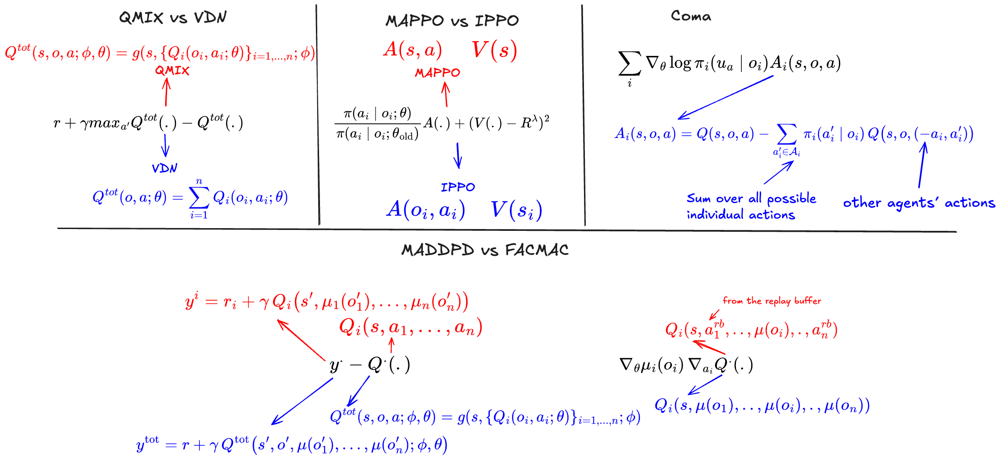

Introduction to MARL
====================

Multi-Agent Reinforcement Learning (MARL) is a generalization of single-agent RL, when having multiple agents during the training process. MARL has many applications in autonomous driving, robotics, and trading to name just a few. MARL can be used to training agents to cooperate, to compete, or to switch between cooperation and competition as necessary. Our focus is on Cooperative MARL. 

Preliminaries
-------------

While single agent RL is modeled using **Markov Decision Process** framework, MARL can be modeled (among other frameworks) using **Partially Observable Stochastic Games (POSG)**. In a POSG we have the following key components: 

    - A set of agents :math:`\mathcal{I} = \{1, 2, ..., n\}`.
    - Individual observations  :math:`o_i` received by each agent :math:`i \in \mathcal{I}`. We use the word *joint observation* :math:`\mathbf{o}` to refer to the concatenation of the individual observations: :math:`\mathbf{o} = (o_1, o_2, ..., o_n)`.
    - Global state :math:`s` of the environment. State is more general than the *local* observation :math:`o_i`. For example, in a 2D grid environment, the state can be the whole map or summuary information about the environment at a given timestep, while the individual observation is the nearby cells. The state is not always provided by the simulators, in such a case, it is usually approximated using the joint observation.
    - Rewards :math:`R_i`. We usually assume that agents receive a common reward, especially in cooperative settings  :math:`\forall i \in \mathcal{I} R_i= R`.

As in single agent RL, we can define policies and action-value functions. We denote by  :math:`\pi_i(.)` and :math:`Q_i(.)` the individual policy and action-value function of agent :math:`i`. 

What makes MARL different than single agent RL ?
------------------------------------------------
MARL inherits multiple concepts and algorithms from single RL, especially the training paradigms: off-policy vs on-policy, policy-based vs value-based, online vs offline .... This can be seen in the algorithms names: PPO becomes MAPPO (or IPPO), DDPG become MADDPG, where the MA prefix refers to Multi-agent. 

However, throughing single RL algorithms into MARL problems yields, in most cases, very poor results. This is due to the many challenges unique to multi-agent settings. Among these challenges, we present the following two:

Non-stationarity and Non-Markovian
^^^^^^^^^^^^^^^^^^^^^^^^^^^^^^^^^^
MDP by default assume stationary policies and stationary environment alongside the markov assumption. But in a multi-agent settings, **and from an individual agent perspective**, those assumptions no longer make sense. 
To understand this, it's important to view it from the perspective of an individual agent: in SARL the transition probability to a new observation :math:`o_{t+1}` from observation :math:`o_t` and action :math:`a_t` doesn't now change over time, the environment dynamics are considered stationary, as well as the policy, the actions probabilities  :math:`\pi(. | o_t)` are independent of time step :math:`t`. However, in MARL settings, as we have multiple agents interaction with the environment simultaniously, the transition probabilities of agent :math:`i` with local observation :math:`o^t_i` and action :math:`a^t_i` dependes on what the other agents are doing at that time step. Given the same conditions :math:`o_i` and :math:`a_i` the transition probabilities will change over time, depending on the other agents. 
This also affect the Markov assumption, as what an individual agent know does not give me the necessary information to predict the next state of an environment with multiple agents. The markov property is a key assumption in RL, it allows us to derive the bellman equations as we use them. 

Credit assignement
^^^^^^^^^^^^^^^^^^
In settings where the environment sends a common reward, it becomes difficult to tell which agent is responsible for that reward, or to what degree each agent contributed to the reward. Not handling the  credit assignement problem may lead to "lazy agent" phenomena, where only a subset of agents is doing most of the work

Centralized vs Decentralized
----------------------------

*Centralized* and *Decentralized* are two important keywords that greatly help us understand and compare different MARL algorithms. They describe to which information a neural network (policy, value or action-value network) takes as input. When individual policies are conditioned only on individual observations :math:`\pi_i(. |o_i)`, we refer to them as *decentralized policies*, the same applies to action-value functions :math:`Q_i(o_i,a_i)`. We usually want (or constrained) to have decentralized policies or action-value function, as they are more convenient during deployment. On the other hand, when a network takes as input the state or the joint observation, we say that it uses central information. In most cases, especially for an actor-critic algorithm, we allow the critic to depend on centralized information, as it's not used during deployment, and restrict the actor to decentralized observations.

Overview of MARL
----------------

A good way to understand and compare MARL algorithm is to look at the loss functions they try to optimize and also to pay attention to what information a network relies on (centralized vs decentralized)

Learning resources
------------------

We assume the reader already has familiarities with Deep Reinforcement Learning. If this is not the case, we highly recommend the following resources:

    1.  `David Silver lectures <https://www.youtube.com/playlist?list=PLqYmG7hTraZDM-OYHWgPebj2MfCFzFObQ>`_ 

    2.  `Spinning Up in Deep RL <https://spinningup.openai.com/en/latest/>`_

    3. `Sergey Levine lectures <https://www.youtube.com/playlist?list=PL_iWQOsE6TfXxKgI1GgyV1B_Xa0DxE5eH>`_

    4. Reading main DRL papers alongside `CleanRL <https://github.com/vwxyzjn/cleanrl>`_ implementations

This is not meant to be an exhaustive list, but steems from a personal experience. Another resources that is very helpfull, especially from an implementation standpoint is to check discussion in `stable-baselines3  <https://github.com/DLR-RM/stable-baselines3>`_ issues and pull requests, there you can find many explanations of common implementation tricks used in reinforcement learning.

With a strong understanding of DRL, learning Deep MARL becomes easier to follow. To approach MARL, we suggest the following:

    1. **A must read**  `Multi-Agent Reinforcement Learning: Foundations and Modern Approaches <https://www.marl-book.com/>`_ (free PDF version available)

    2. Read MARL papers.

We also recommand checking `EPyMARL <https://github.com/uoe-agents/epymarl>`_ for implementations. 
     